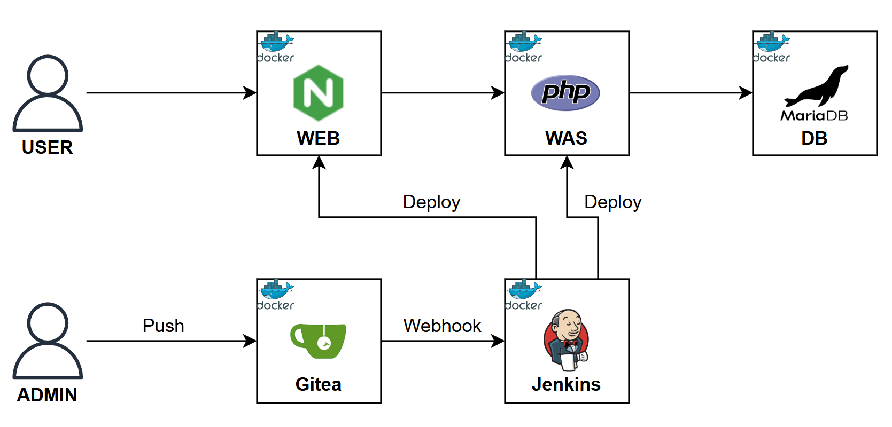

# 아키텍처


# Gitea + Jenkins (Vagrant)
- 사설 Git 서버(Gitea)와 CI 서버(Jenkins)로 CI/CD 실습 환경 구축
- 샘플 게시판 폼 구현
- Nginx web tier, PHP/Apache app tier, MariaDB, Jenkins, Gitea
- IaC: Vagrant

# 선행조건
- Oracle VM VirtualBox를 설치하셔야 합니다.
- Vagrant를 설치하셔야 합니다.

# 사용방법
- Vagrantfile 파일을 up만 하면 됩니다.

# Windows (PowerShell)
```powershell
# 레포지토리 클론
git clone https://github.com/woongaga/cicd-lab.git
cd cicd-lab
```

# Linux
```bash
# 레포지토리 클론
git clone https://github.com/woongaga/cicd-lab.git
cd cicd-lab
```

# 배포 및 삭제
```bash
# 배포
vagrant up

# 삭제/정리
vagrant destroy -f
vagrant global-status --prune

# powershell
Remove-Item -Recurse -Force .vagrant, jenkins_initial_admin_password.txt

# Linux
rm -rf .vagrant jenkins_initial_admin_password.txt
```

# 생성물
- 1대 VM (사설망 192.168.56.102)
  - 내부에서 구동되는 Docker 컨테이너
    - Gitea: http://192.168.56.102:13000
    - Jenkins: http://192.168.56.102:18081
      - 초기 비밀번호가 프로젝트 루트의 jenkins_initial_admin_password.txt로 자동 저장
    - 샘플 Web/WAS(nginx/php-fpm): Jenkins 파이프라인 배포 후 http://192.168.56.102:18080
    - MariaDB: 내부 네트워크(corpnet) 전용

# 검증
자세한 사용법은 👉 [노션 가이드](https://www.notion.so/Gitea-Jenkins-28683b9724278019a536d848f924f60a?source=copy_link)를 참고하세요.

# 유의할 점
- Host PC의 RAM: ≥ 2 GB 권장 (VM 1대 × 2GB)
- Host PC의 디스크 용량: ≥ 4 GB 필수
- 프로젝트의 DB 계정/비밀번호 설정은 데모를 위한 값입니다. 실제 운영 환경에는 강력한 비밀번호/방화벽/네트워크 분리/권한 최소화를 적용하세요.
